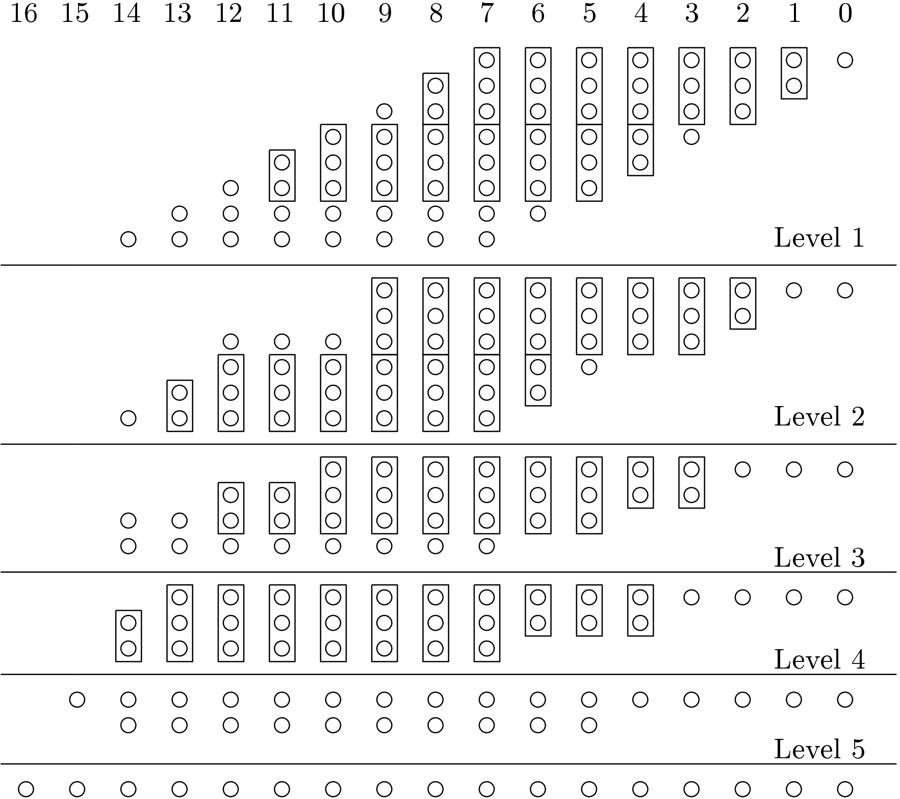
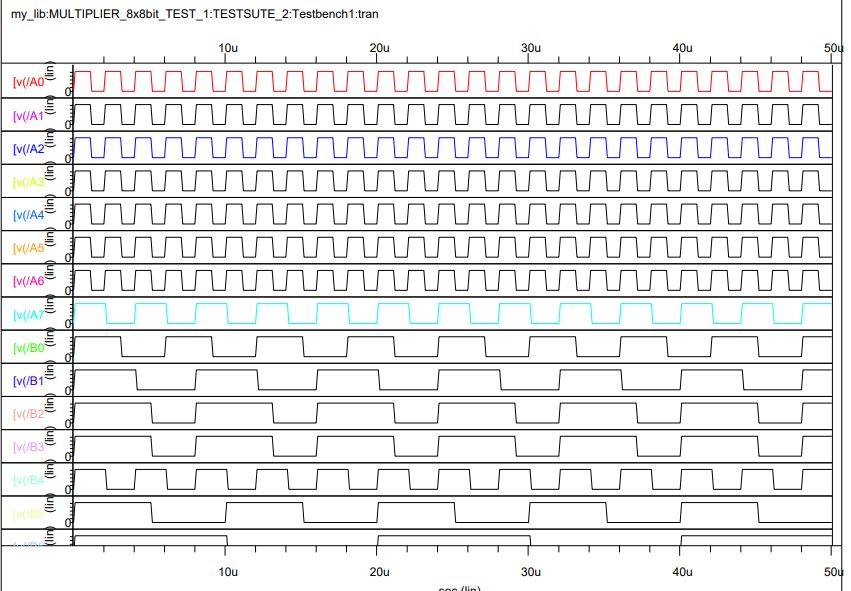
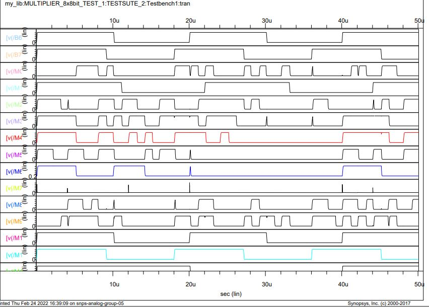
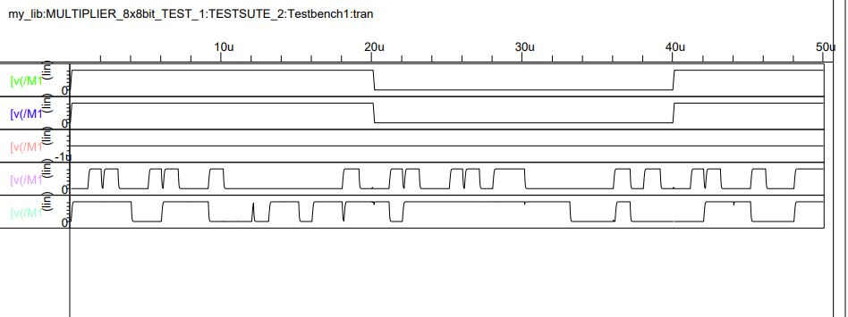

# CMOS Implementation of 8bit Wallace Tree Multiplier

This repository presents the design of 8bit Wallace Tree Multiplier implemented using Synopsis Custom Compiler on 28nm CMOS Technology.

##  Table Of Content
   * [Abstract](##Abstract)
   * [Detailed Explanation](##Detailed-Explanation)
   * [Reference Circuit](#Reference-Circuit)
   * [Tools Used](#Tools-Used)
   * [CMOS AND Gate](#CMOS-AND-Gate)
   * [CMOS OR Gate](#CMOS-OR-Gate)
   * [CMOS NOT Gate](#CMOS-NOT-Gate)
   * [CMOS XOR Gate](#CMOS-XOR-Gate)
   * [Half Adder Module](#Half-Adder-Module)
   * [Full Adder Module](#Full-Adder-Module)
   * [CMOS 8X1 Multiplier](#CMOS-8X1-Multiplier)
   * [Design Approach](#Design-Approach)
   * [LAYER_1(Group-1) Reduction](#LAYER_1(Group-1)-Reduction)
   * [LAYER_1(Group-2) Reduction](#LAYER_1(Group-2)-Reduction)
   * [LAYER_1(Group-3) Reduction](#LAYER_1(Group-3)-Reduction)
   * [LAYER_2(Group-4) Reduction](#LAYER_2(Group-4)-Reduction)
   * [LAYER_2(Group-5) Reduction](#LAYER_2(Group-5)-Reduction)
   * [LAYER_3(Group-6,7) Reduction](#LAYER_3(Group-6,7)-Reduction)
   * [LAYER_4 Reduction](#LAYER_4-Reduction)
   * [Ripple Carry Adder](#Ripple-Carry-Adder)
   * [Multiplication Module](#Multiplication-Module)
   * [Simulations](#Simulations)
   * [Netlist](#Netlist)
   * [Acknowledgements](#Acknowledgements)
   * [References](#References)
 

## Abstract
A Wallace multiplier is a digital circuit that multiplies two integers. It uses a selection of full and half adders (the Wallace tree or Wallace reduction) to sum partial products in stages until two numbers are left. Wallace multipliers reduce as much as possible on each layer.

The Wallace tree has three steps:

    1)Multiply each bit of one of the arguments, by each bit of the other.

    2)Reduce the number of partial products using layers of full and half adders.

    3)Wires having same weight are added, until a single layer of bits are remaining.

Compared to naively adding partial products with regular adders, the benefit of the Wallace tree is its faster speed.

## Detailed Explanation
- STEP-1:

    The first step is to multiply each digit (each bit) of one factor by each digit of the other. Each of these partial products has weight equal to the product of its factors. The final product is calculated by the weighted sum of all these partial products.

- STEP-2:

    As long as we have 3 or more wires with the same weight 
    , the resulting bits are reduced using full adders and half adders.

- STEP-3:

    This is the final step, where we are left with less than 2 bits having same weight.
    In this stage we can use conventional adder circuits(ripple carry adder, carry look a head adder or serial adder) based on our constraint(area, power and complexity).

Lets consider multiplication of 2 4bit numbers
    A=a3 a2 a1 a0  and  B=b3 b2 b1 b0
    
    1. First we multiply the numbers bit by bit
            
            weight 1  - a0b0
            weight 2  - a0b1, a1b0
            weight 4  - a0b2, a1b1, a2b0
            weight 8  - a0b3, a3b0, a1b2, a2b1
            weight 16 - a1a3, a2b2, a3b1
            weight 32 - a2b3, a3b2
            weight 64 - a3b3

    2. Reduction layer 1:

            Pass the only weight-1 wire through,
                                outputs: 1 weight-1 wire
            Add a half adder for weight 2, 
                                outputs: 1 weight-2 wire, 1 weight-4 wire
            Add a full adder for weight 4, 
                                outputs: 1 weight-4 wire, 1 weight-8 wire
            Add a full adder for weight 8, and pass the remaining wire through, 
                                outputs: 2 weight-8 wires, 1 weight-16 wire
            Add a full adder for weight 16, 
                                outputs: 1 weight-16 wire, 1 weight-32 wire
            Add a half adder for weight 32, 
                                outputs: 1 weight-32 wire, 1 weight-64 wire
            Pass the only weight-64 wire through, 
                                output: 1 weight-64 wire
    
    3. Wires at the output of reduction layer 1:

            weight 1  – 1
            weight 2  – 1
            weight 4  – 2
            weight 8  – 3
            weight 16 – 2
            weight 32 – 2
            weight 64 – 2

    4. Reduction layer 2:

            Add a full adder for weight 8, and half adders for weights 4, 16, 32, 64
    
    5. Outputs:

            weight 1   – 1
            weight 2   – 1
            weight 4   – 1
            weight 8   – 2
            weight 16  – 2
            weight 32  – 2
            weight 64  – 2
            weight 128 – 1
    
    6. Use conventional adder circuits to get the final result.
    
    
## Reference Circuit
2 dots realized to Half adders, 3 dots realized to Full adders.

 
  REF CIRCUIT 

## Tools Used

- Synopsys Custom Compiler:  The Synopsys Custom Compiler™ design environment is a modern solution for full-custom analog, custom digital, and mixed-signal IC design. As the heart of the Synopsys Custom Design Platform, Custom Compiler provides design entry, simulation management and analysis, and custom layout editing features. This tool was used to design the circuit on a transistor level.
- Synopsys Primewave:  PrimeWave™ Design Environment is a comprehensive and flexible environment for simulation setup and analysis of analog, RF, mixed-signal design, custom-digital and memory designs within the Synopsys Custom Design Platform. This tool helped in various types of simulations of the above designed circuit.
- Synopsys 28nm PDK:  The Synopsys 28nm Process Design Kit(PDK) was used in creation and simulation of the above designed circuit.
## CMOS AND Gate

  
  

## CMOS OR Gate 

  
  

## CMOS XOR Gate

  
  

## CMOS NOT Gate 

  
  

## Half Adder Module

 
  HALF ADDER USING BASIC GATES  

## Full Adder Module

 
 FULL ADDER USING HALF ADDERS  

## CMOS 8X1 Multiplier

 
 8x1 MULTIPLIER  

## Design Approach

we have all the basic elements to build the reduction layers. Reduction layers are build as follows:

    
        1. First 3 partial product terms are grouped to group-1.
                    Group-1 includes A0B, A1B, A2B partial products.

        2. Next 3 partial product terms are grouped to group-2 
                    Group-2 includes A3B, A4B, A5B partial products.

        3. Remaining 2 partial products are grouped to group-3.
                    Group-3 includes A6B, A7B partial products.

The partial product terms goes through series of reduction layers until there are less than 3 wires having same weight.
Reduction layers consists of Full adders and half adders.

In the final stage, we have less than 3 wires having same weights. To get final result we can use ripple carry adder or a carry look a head adder to reduce it to 1bit for each weight.

## LAYER_1(Group-1) Reduction 
The design implemeted in the below schematic reduces A0B, A1B, A2B partial products. This layer uses 3 8x1-Multipliers, Halfadders and Fulladders.

 
  GROUP-1 REDUCTION SCHEMATIC  

## LAYER_1(Group-2) Reduction 
The design implemeted in the below schematic reduces A3B, A4B, A5B partial products. It uses 3 8x1-Multipliers, Halfadders and Fulladders.

 
  GROUP-2 REDUCTION SCHEMATIC  

## LAYER_1(Group-3) Reduction

In the below shown schematic, module generates partial product terms A6B and A7B.
These Partial products are passed to next layer for reduction. This layer uses only Halfadders and Fulladders.

 
  GROUP-3 PARTIAL PRODUCTS GENERATION SCHEMATIC  

## LAYER_2(Group-4) Reduction
The outputs obtained from LAYER_1(Group-1) and the sum terms obtained from LAYER_1(Group-2) are grouped to form group-5.
Below schematic shows the implementation of reduction circuit for group-4 elements. All the subsequent layers uses only Halfadders and Fulladders.
 

 
  GROUP-4 REDUCTION SCHEMATIC  

## LAYER_2(Group-5) Reduction
The outputs obtained from LAYER_1(Group-3) and the carry terms obtained from LAYER_1(Group-2) are grouped to form group-5.
Below schematic shows the implementation of reduction circuit for group-5 elements.
 

 
  GROUP-5 REDUCTION SCHEMATIC  

## LAYER_3(Group-6,7) Reduction
All the terms obtained from LAYER_2 are grouped into group-6 and Group-7.
Group-6 is reduced in LAYER_3, Group-7 is passed to next layer for reduction.

Below schematic shows the implementation of reduced circuit for group-6.

 
  GROUP-6 REDUCTION SCHEMATIC 

## LAYER_4 Reduction
This is the final reduction stage and the outputs obtained from this stage have less than 2 wires for same weights and thus can be given to addeer circuits to obtain result.
Below schematic shows the implementation of this reduction circuit for this layer.

 
  GROUP-7 REDUCTION SCHEMATIC

## Ripple Carry  Adder 
Final processing of outputs obtained from the LAYER_4 is done by this stage. 
Below schematic shows the implementation of ripple carry adder.

 
  RIPPLE CARRY ADDER

## Multiplier Circuit 
Feed the outputs obtained from LAYER_4 to the ripple carry adder to get the final product terms(result).

 
  FINAL MULTIPLIER CIRCUIT 

## Simulations 

 
  TEST FOR TRANSIENT ANALYSIS

 
  SIMULATION RESULT-1

 
  SIMULATION RESULT-2

 
  SIMULATION RESULT-3

## Netlist

Refer to the netlist of the circuits here: <a href='/files/transient_analysis.txt'> Netlist </a>

## Author

- Maharshi Soma Venkata, MTech VLSI System Design, National Institute of Technology, Trichy-620015.

## Acknowledgements

 - [Kunal Ghosh, Co-founder, VSD Corp. Pvt. Ltd.](https://www.iith.ac.in/events/2022/02/15/Cloud-Based-Analog-IC-Design-Hackathon/)
 - [Cloud Based Analog IC Design Hackathon](https://www.iith.ac.in/events/2022/02/15/Cloud-Based-Analog-IC-Design-Hackathon/')
 - [Synopsys India](https://www.synopsys.com/)
 - [Sameer Durgoji, NIT Karnataka](https://www.iith.ac.in/events/2022/02/15/Cloud-Based-Analog-IC-Design-Hackathon/)
 - [Chinmay panda, IIT Hyderabad](https://www.iith.ac.in/events/2022/02/15/Cloud-Based-Analog-IC-Design-Hackathon/)

## References
- [1] C.S. Wallace, A suggestion for a fast multiplier, IEEE Trans. Computers, Vol. 13, pp. 14-17, Feb. 1964. 
- [2] https://en.wikipedia.org/wiki/Wallace_tree
- [3] K. Prasad and K.K. Parhi, Low-power 4-2 and 5-2 compressors, Proc. of 2001 Asilomar Conf. on Signals, Systems and Computers, Pacific Grove, CA, USA. 
- [4] Neil H. Weste and Kamran Eshraghian, Principles of CMOS VLSI design-A Systems Perspective, Pearson Edition Pvt Ltd. 3rd edition. 
- [5] N. Sureka ; R. Porselvi ; K. Kumuthapriya, “An Efficient High Speed Wallace Tree Multiplier”, 2013 International Conference on Information Communication and    Embedded Systems (ICICES). Technologies
